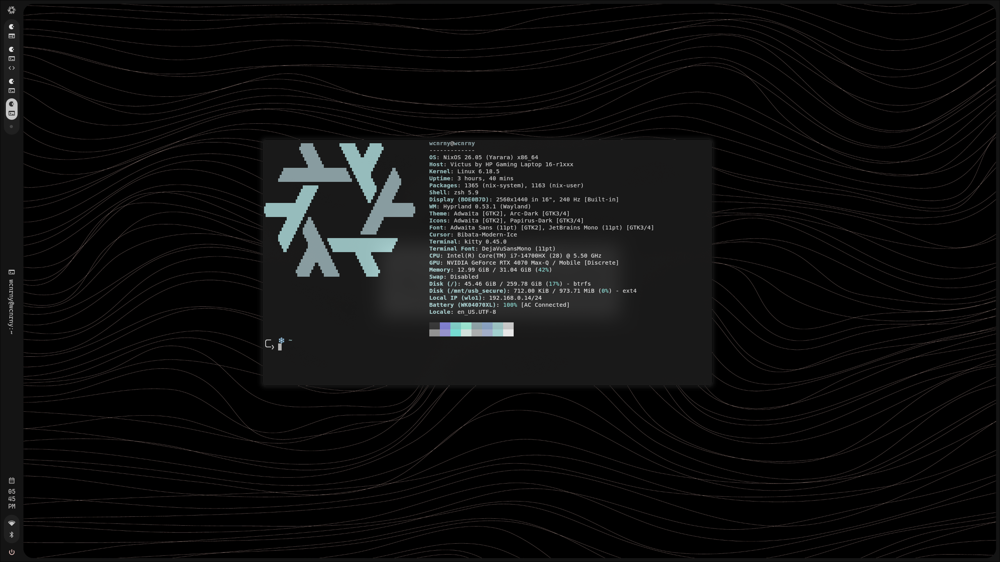

<div align="center">
  
  <h1>NixOS Configuration / Dotfiles</h1>
  
  <p>
    <strong>Declarative. Reproducible. Engineering-Focused.</strong>
  </p>

  <p>
    <a href="https://nixos.org">
      
    </a>
    <a href="https://hyprland.org">
      
    </a>
    <a href="https://github.com/folke/lazy.nvim">
      
    </a>
  </p>
</div>

<br />

> **Note:** This configuration is designed for an **Electrical & Electronics Engineering** workflow, prioritizing isolated development environments (`nix develop`) for Embedded Systems (Rust, C++, ESP32) over global package pollution.

---

## Showcase


---

## Tech Stack

| Category | Component | Description |
| :--- | :--- | :--- |
| **OS** | NixOS (Unstable) | Managed via **Flakes** & Home Manager |
| **WM** | Hyprland | Dynamic Tiling Window Manager |
| **Terminal** | Kitty | GPU-accelerated, highly configurable |
| **Shell** | Zsh + Starship | Fast, feature-rich shell prompt |
| **Editor** | Neovim | *(Work in Progress)* Lua-based configuration |
| **Launcher** | Rofi | Wayland fork for application launching |
| **Browser** | Zen & Brave | Privacy-focused browsing |
| **Bar** | Quickshell | *(Planned)* Qt/QML based status bar |
| **Theming** | Dynamic | Colors generated based on current wallpaper |

---

## Hardware: HP Victus 16 (r1012nt 9k1jea)

This configuration is optimized for the following hardware but is modular enough to be adapted for other systems.

| Component | Specification |
| :--- | :--- |
| **CPU** | Intel Core i7-14700HX (14th Gen) |
| **GPU** | NVIDIA GeForce RTX 4070 (8GB) |
| **RAM** | 32GB DDR5 |
| **Target** | x86_64-linux |

---

## Repository Structure

My configuration follows a modular architecture to separate hardware-specific configs from user-space dotfiles.

```text
dotfiles
├── flake.nix
├── hosts
│   └── wcnrny
├── modules
├── configs
│   ├── hypr
│   ├── SystemConfigs
│   └── UserConfigs
└── ...
```
## Installation

Warning: Review hardware-configuration.nix before applying.
```bash
git clone https://github.com/wcnrny/dotfiles.git /etc/nixos
cd /etc/nixos
```

Generate Hardware Config (If on new machine):
```bash
nixos-generate-config --show-hardware-config > ./hosts/wcnrny/hardware-configuration.nix
```
Build & Switch:
```bash
sudo nixos-rebuild switch --flake .#wcnrny
```

## License

This configuration is open-source. Feel free to steal parts of it for your own setup.